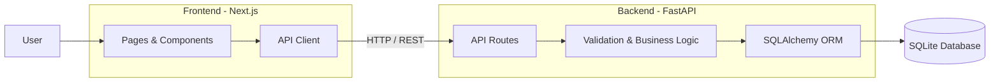
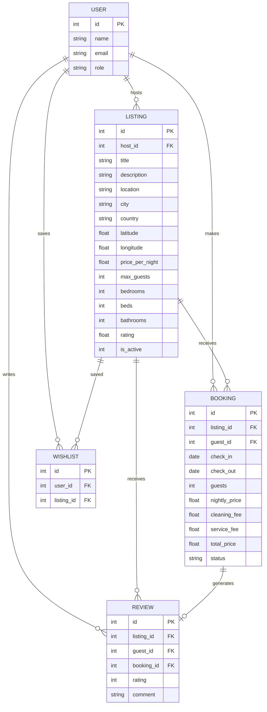
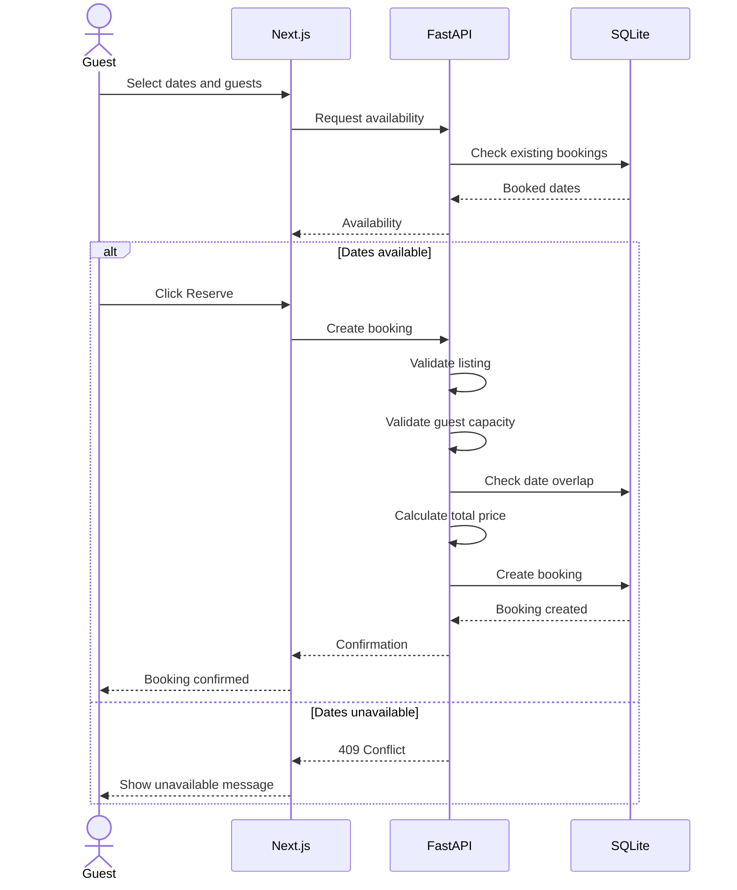

# Airbnb Clone

A full-stack Airbnb-inspired accommodation booking platform built with **Next.js, TypeScript, FastAPI, SQLAlchemy, and SQLite**.

The application recreates the core Airbnb experience, including listing discovery, search and filtering, property details, availability checking, bookings, wishlists, reviews, and host listing management.

---

## Features

### Guest Experience

- Browse accommodation listings
- Search by location, dates, and number of guests
- Filter listings by price
- Paginated search results
- View detailed property information
- Property photo gallery
- Amenities and location map
- Availability checking
- Date and guest validation
- Booking and mock checkout
- Booking confirmation
- My Trips
- Wishlist
- Reviews and ratings
- Light and dark mode
- Responsive design

### Host Experience

- Host dashboard
- Create listings
- Edit listings
- Delete listings
- View hosted properties
- View guest bookings
- Listing ownership validation

### Backend

- REST API built with FastAPI
- SQLAlchemy ORM
- SQLite database
- Server-side booking validation
- Date-overlap prevention
- Server-side price calculation
- Guest capacity validation
- Review eligibility validation
- Automatic rating aggregation

---

## Tech Stack

| Layer | Technology |
|---|---|
| Frontend | Next.js, React, TypeScript |
| Styling | Tailwind CSS |
| Backend | FastAPI, Python |
| ORM | SQLAlchemy |
| Database | SQLite |
| Maps | Leaflet + OpenStreetMap |
| API | REST |
| Version Control | Git + GitHub |

---

## Architecture

The application follows a client-server architecture with a clear separation between the frontend, backend API, and database.



---

## Project Structure

```text
airbnb-clone/
│
├── frontend/
│   ├── app/
│   │   ├── page.tsx
│   │   ├── listings/
│   │   │   └── [id]/
│   │   ├── checkout/
│   │   ├── booking-confirmation/
│   │   ├── trips/
│   │   ├── wishlist/
│   │   └── host/
│   │
│   ├── components/
│   │   ├── booking/
│   │   ├── listings/
│   │   ├── reviews/
│   │   ├── map/
│   │   ├── host/
│   │   └── layout/
│   │
│   ├── lib/
│   │   └── api.ts
│   │
│   └── package.json
│
├── backend/
│   ├── app/
│   │   ├── main.py
│   │   ├── database.py
│   │   ├── models.py
│   │   │
│   │   ├── schemas/
│   │   │   ├── user.py
│   │   │   ├── listing.py
│   │   │   ├── booking.py
│   │   │   └── review.py
│   │   │
│   │   └── api/
│   │       ├── users.py
│   │       ├── listings.py
│   │       ├── bookings.py
│   │       ├── wishlist.py
│   │       └── reviews.py
│   │
│   ├── seed.py
│   └── requirements.txt
│
├── .gitignore
└── README.md
```

---

## Database Architecture

The application uses a relational SQLite database.



---

## Booking Flow

Booking validation happens on the backend to prevent invalid and overlapping reservations.



### Preventing Overlapping Bookings

Two bookings conflict when:

```text
existing.check_in < requested.check_out
AND
existing.check_out > requested.check_in
```

The backend performs this check before creating a booking.

### Price Calculation

The final booking price is calculated server-side.

```text
Subtotal     = price per night × number of nights
Cleaning Fee = ₹500
Service Fee  = 10% of subtotal
Total        = Subtotal + Cleaning Fee + Service Fee
```

The booking stores the nightly price and calculated fees as a price snapshot so that historical bookings remain consistent if listing prices change later.

---

## API Overview

### Listings

| Method | Endpoint | Description |
|---|---|---|
| GET | `/listings/` | Search and filter listings |
| GET | `/listings/{id}` | Get listing details |
| POST | `/listings/` | Create listing |
| PUT | `/listings/{id}` | Update listing |
| DELETE | `/listings/{id}` | Delete listing |
| GET | `/listings/host/` | Get host listings |

### Bookings

| Method | Endpoint | Description |
|---|---|---|
| POST | `/bookings/` | Create booking |
| GET | `/bookings/` | Get guest bookings |
| GET | `/bookings/{id}` | Get booking |
| GET | `/bookings/availability/{id}` | Get booked dates |
| GET | `/bookings/host/` | Get host bookings |

### Wishlist

| Method | Endpoint | Description |
|---|---|---|
| GET | `/wishlist/` | Get wishlist |
| POST | `/wishlist/{listing_id}` | Add listing |
| DELETE | `/wishlist/{listing_id}` | Remove listing |

### Reviews

| Method | Endpoint | Description |
|---|---|---|
| GET | `/reviews/{listing_id}` | Get reviews |
| POST | `/reviews/{listing_id}` | Create review |

---

## Getting Started

### Prerequisites

- Node.js 18+
- Python 3.10+
- Git

### 1. Clone the repository

```bash
git clone https://github.com/aditiparth/airbnb-clone.git
cd airbnb-clone
```

### 2. Start the Backend

```bash
cd backend
```

Create and activate a virtual environment (Windows):

```powershell
python -m venv venv
.\venv\Scripts\Activate.ps1
```

Install dependencies:

```bash
pip install -r requirements.txt
```

Seed the database:

```bash
python seed.py
```

Start FastAPI:

```bash
uvicorn app.main:app --reload
```

- Backend: http://127.0.0.1:8000
- API documentation: http://127.0.0.1:8000/docs

### 3. Start the Frontend

Open another terminal:

```bash
cd frontend
npm install
```

Create `frontend/.env.local` and add:

```env
NEXT_PUBLIC_API_URL=http://127.0.0.1:8000
```

Start Next.js:

```bash
npm run dev
```

- Frontend: http://localhost:3000

---

## Demo Users

The seeded database contains demo guest and host users.

**Guest**

- Name: Aditi
- Email: guest@airbnbclone.com
- Role: guest

**Host**

- Name: Airbnb Host
- Email: host@airbnbclone.com
- Role: host

Authentication is simplified for this assignment using predefined demo users.

---

## Testing

The following workflows can be tested:

**Guest**

- Search for a city
- Apply filters
- Open a listing
- Check availability
- Select dates
- Complete mock checkout
- View booking in My Trips
- Add/remove wishlist items
- Submit a review

**Host**

- Open Host Dashboard
- Create a listing
- Edit a listing
- Delete a listing
- View hosted listings
- View guest bookings

### Booking Validation

The application validates:

- Check-out after check-in
- Guest count within listing capacity
- Availability of selected dates
- Overlapping booking prevention
- Server-side price calculation
- Review eligibility
- Duplicate reviews

---

## Design

The interface is inspired by Airbnb's clean, image-focused design language while being implemented independently.

Key design decisions include:

- Large property imagery
- Clean listing cards
- Minimal navigation
- Sticky booking card
- Responsive layouts
- Clear validation feedback
- Wishlist interactions
- Light and dark themes

---

## Assumptions

For the scope of this assignment:

- Authentication is simplified
- Payments are simulated through mock checkout
- Messaging is not implemented
- Identity verification is not implemented
- Maps use basic property markers
- Images are provided through URLs
- SQLite is used as the database
- Exact property addresses are not exposed before booking

A production implementation would replace these simplified components with authenticated sessions, real payments, cloud storage, and a production database.

---

## Future Improvements

- JWT/session-based authentication
- PostgreSQL
- Cloud image storage
- Multiple images per listing
- Advanced map-based search
- Payment integration
- Guest/host messaging
- Email notifications
- Superhost system
- Review categories
- Automated testing
- CI/CD
- Redis caching
- Production monitoring

---

## Author

**Aditi Parthasarathi**
Computer Science & Engineering
GitHub: [@aditiparth](https://github.com/aditiparth)
